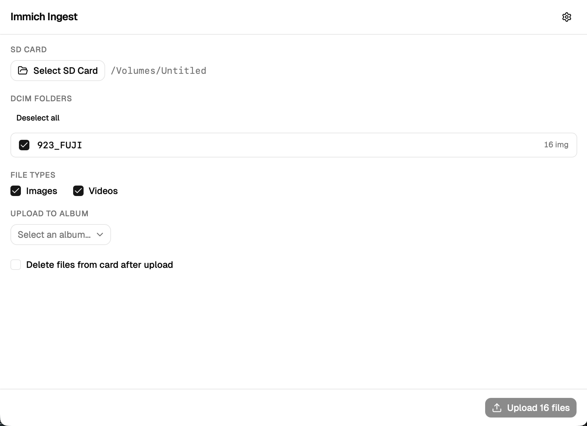
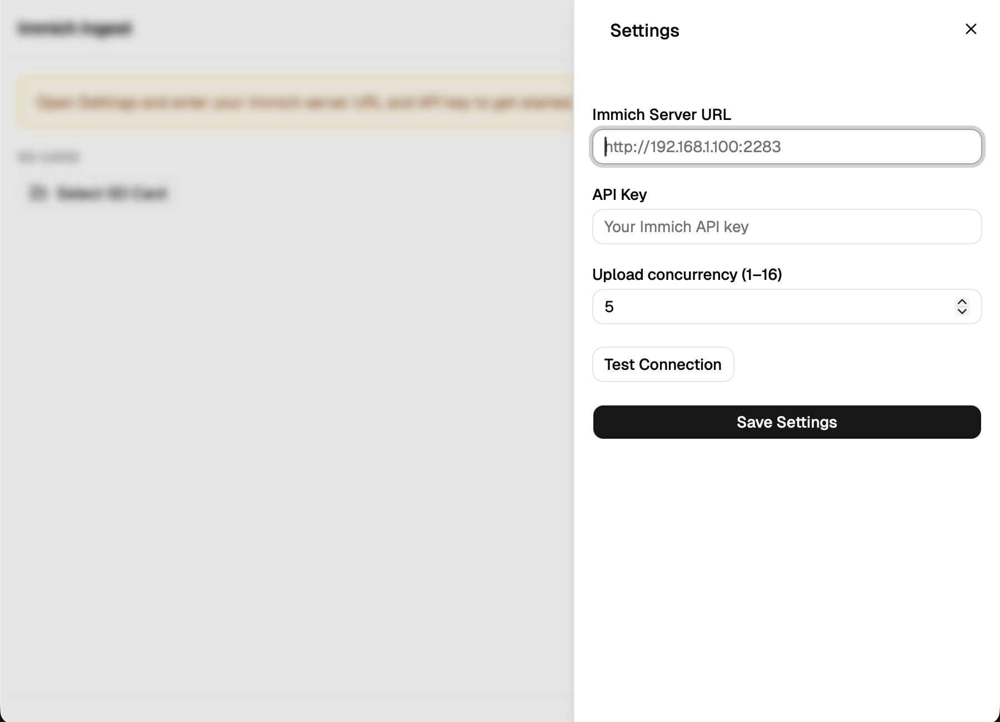

# immich-ingest

Desktop app for bulk-uploading camera SD card images to [Immich](https://immich.app). Built with Tauri 2, React, and TypeScript.



## What it does

1. Select your SD card root folder
2. Choose which DCIM subfolders to upload
3. Pick an Immich album (or create one)
4. Upload images and/or videos in parallel
5. Optionally delete files from the card after a successful upload

Duplicate detection is handled automatically by Immich — already-uploaded files are skipped without re-uploading.

## Supported file types

Images: JPG, JPEG, PNG, HEIC, RAF, ARW, CR2, CR3, NEF, DNG, ORF, RW2

Videos: MP4, MOV, AVI, MKV

Works with any camera following the DCF standard (Fujifilm, Sony, Canon, Nikon, etc.).

## Setup



1. In your Immich web UI: **Account Settings → API Keys → New API Key**
   - Required permissions: `asset.upload`, `albumAsset.create`, `album.read`, `album.create`
2. Install the app (or run `npm run tauri dev` for development)
3. Open Settings (gear icon), enter your Immich server URL and API key
4. Click **Test Connection** to verify

## Roadmap

- [ ] macOS notarization & App Store publishing
- [ ] Windows Store publishing
- [ ] Auto-detect SD card insertion and prompt to upload
- [ ] Upload progress per file (currently batch-level only)
- [ ] Support for multiple albums in a single upload
- [ ] Retry failed uploads automatically
- [ ] Upload history / log view

## macOS note

The app is not yet notarized with Apple. On first launch you may see a warning that Apple cannot verify it is free of malware. To open it anyway:

1. Right-click the app → **Open** → click **Open Anyway**, or
2. Run in terminal: `xattr -dr com.apple.quarantine /Applications/Immich\ Sync.app`

## Development

Requirements: Node 18+, Rust 1.75+, Tauri CLI v2

```bash
npm install
npm run tauri dev
```

Build a release binary:

```bash
npm run tauri build
```
